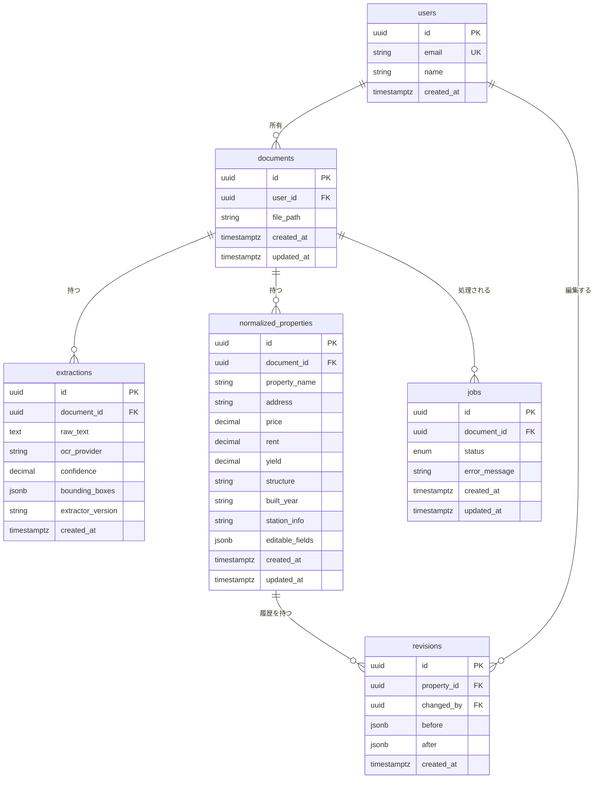

# ER図

- Title: ER図（エンティティ関係図）
- Status: Draft
- Created: 2026-03-06
- Last Updated: 2026-03-06
- Owner: keikur1hara
- Language: JA/EN

## エンティティ関係図



## テーブル設計方針

| 方針 | 内容 |
|---|---|
| 主キー | 全テーブル UUID (`gen_random_uuid()`) |
| タイムスタンプ | `created_at` は全テーブル必須。更新対象テーブルは `updated_at` も必須 |
| JSONB | `bounding_boxes`（OCR座標）、`editable_fields`（可変フィールド）、`before`/`after`（差分） |
| 外部キー | `documents` 削除時は関連レコードをカスケード削除。`users` 削除時は RESTRICT |
| インデックス | 全 FK カラムにインデックス。`jobs.status` にも追加（Worker用） |

## データフロー

```text
users
  └── documents          ← アップロードされた物件概要書
        ├── extractions  ← OCR生テキスト（Worker が書き込む）
        ├── normalized_properties  ← LLM正規化データ（Worker が書き込む）
        │     └── revisions  ← ユーザー編集差分
        └── jobs         ← 非同期処理キュー
```

## データ分離原則

- `extractions`（生OCRデータ）と `normalized_properties`（確定済み編集可能データ）は別テーブルに保持する
- 両者を統合・マージしてはならない（後からOCR結果の再参照が必要なため）

## 関連ドキュメント

- Prismaスキーマ: `packages/db/prisma/schema.prisma`
- システムアーキテクチャ: `docs/design/20260225-system-architecture.md`

## 概要 / Summary (JA)

全6テーブル（users / documents / extractions / normalized_properties / revisions / jobs）の関係を定義する。UUID主キー・JSONB活用・FK制約・インデックス設計を方針として固定し、生OCRデータと確定済み編集可能データを分離することを原則とする。

## Summary (EN)

Defines the relationships among all six tables: users, documents, extractions, normalized_properties, revisions, and jobs. Key design constraints include UUID primary keys, JSONB usage, FK constraints with index coverage, and strict separation of raw OCR data from confirmed normalized data.

## 結論 / Conclusion (JA)

本ER図を基準として実装・マイグレーションを進める。スキーマ変更時は Prismaマイグレーションを作成し、本ドキュメントを同一PRで更新する。

## Conclusion (EN)

Implementation and migrations should follow this ER diagram as the baseline. Schema changes require a Prisma migration and an update to this document in the same PR.
