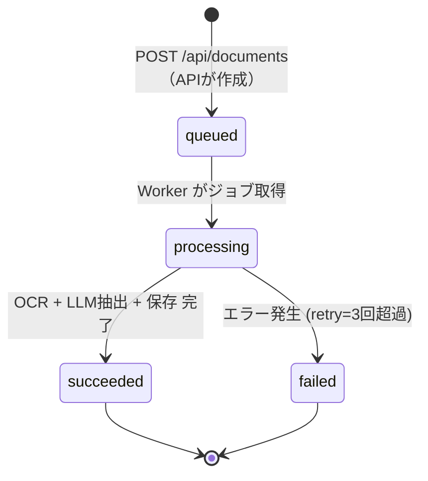

# Job 状態遷移図

- Title: Job 状態遷移図
- Status: Draft
- Created: 2026-03-06
- Last Updated: 2026-03-06
- Owner: keikur1hara
- Language: JA

## 状態遷移図

## 状態定義

| 状態 | 説明 | 書き込み主体 |
|---|---|---|
| `queued` | ジョブ登録済み、Worker待ち | API (`POST /api/documents`) |
| `processing` | Worker が処理中 | Worker |
| `succeeded` | OCR・LLM・保存が全て完了 | Worker |
| `failed` | エラー発生、retry上限超過 | Worker |

## 遷移ルール

- `queued → processing`: Worker がジョブを取得した時点で即時更新する。取得と更新はトランザクション内で行う（二重取得防止）。
- `processing → succeeded`: `extractions` と `normalized_properties` の保存が完了してから更新する。
- `processing → failed`: 例外発生時、`error_message` にエラー内容を記録してから更新する。retry は Worker 側で管理し、上限（3回）超過後に `failed` に遷移する。
- 終端状態（`succeeded` / `failed`）からの再遷移は行わない。再処理が必要な場合は新規 Job を作成する。

## タイムアウト

- Worker 1ジョブあたりの実行タイムアウト: **300秒**
- タイムアウト発生時は `failed` に遷移し `error_message: "timeout"` を記録する。

## UI のポーリング動作

| jobs.status | UIの動作 |
|---|---|
| `queued` | 処理待ち表示、3秒後に再ポーリング |
| `processing` | 処理中表示、3秒後に再ポーリング |
| `succeeded` | 解析完了、結果画面へ遷移 |
| `failed` | エラー表示（`error_message` を表示） |

## 関連ドキュメント

- 状態定義コード: `packages/domain/src/jobs/status.ts`
- シーケンス図: `docs/design/20260306-sequence-diagrams.md`
- API仕様: `contracts/openapi/phase0.yaml`
