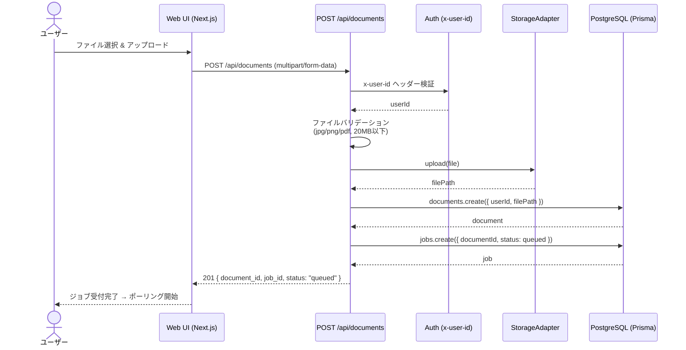
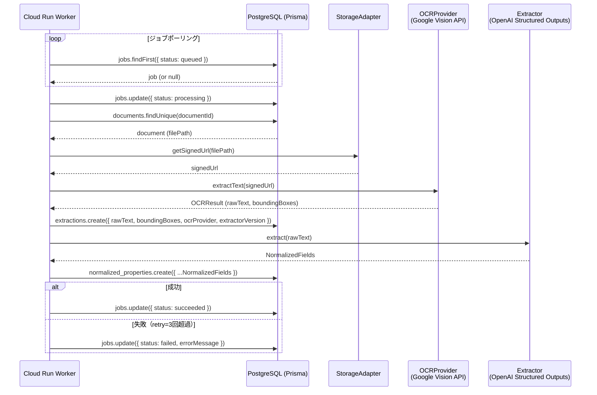
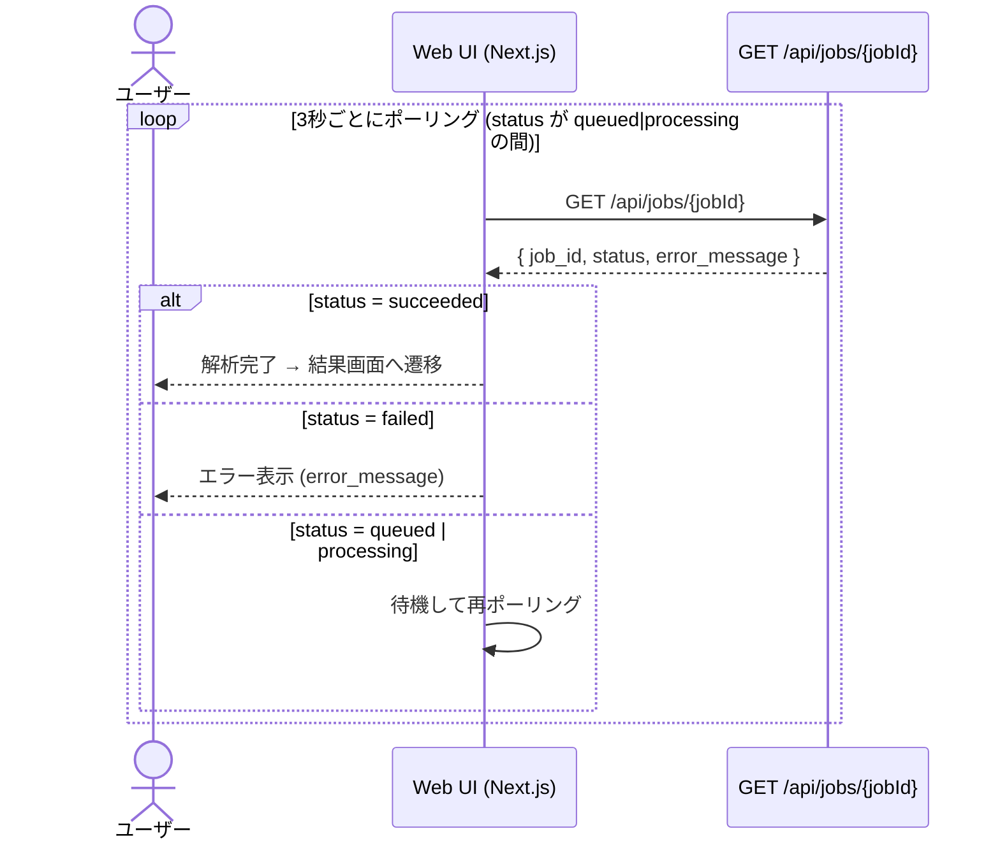

# シーケンス図

- Title: シーケンス図（アップロード / Worker処理 / ステータスポーリング）
- Status: Draft
- Created: 2026-03-06
- Last Updated: 2026-03-06
- Owner: keikur1hara
- Language: JA

## 1. アップロード & ジョブ作成フロー

ユーザーが画像/PDFをアップロードし、非同期ジョブが登録されるまでの流れ。

## 2. Worker 非同期処理フロー

Cloud Run Worker がジョブを取得し、OCR → LLM抽出 → 正規化データ保存するまでの流れ。

## 3. ジョブステータスポーリングフロー

UI がジョブ完了を検知し、結果を表示するまでの流れ。

## 関連ドキュメント

- システムアーキテクチャ: `docs/design/20260225-system-architecture.md`
- Job状態遷移: `docs/design/20260306-job-state-machine.md`
- API仕様: `contracts/openapi/phase0.yaml`
